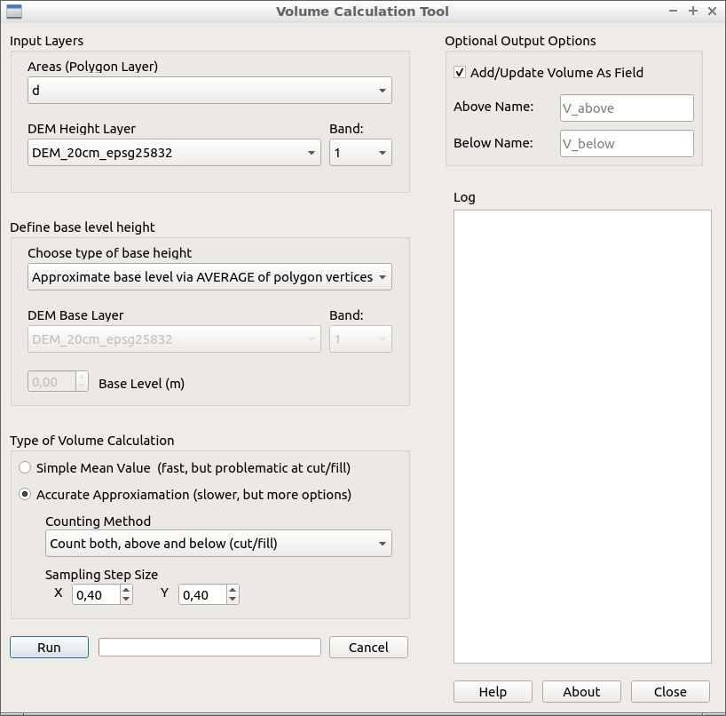

.. VolumeCalculationTool documentation master file, created by
   sphinx-quickstart on Sun Feb 12 17:11:03 2012.
   You can adapt this file completely to your liking, but it should at least
   contain the root `toctree` directive.

Volume Calculation Tool Documentation
============================================

.. toctree::
   :maxdepth: 2

Plugin Purpose
..............

The VolumeCalculationTool allows for easy calculation of the volume inside multiple polygons based on a DEM layer. If you are in need of precise measurements the tooling provided by GRASS should be used as by the nature of raster layers and QGIS plugins the calculations are only approximations.

In order to use the tool the following data needs to be available:

* A raster layer, usually a DEM.
* A vector layer, which must contain one or more polygons.
* Both layers must use the same coordinate system, both layers must overlap (the polygons need to be within the raster layer), both layers must use meters as units.
* If the volume is to be set (as an attribute) for each polygon then the vector layer must be editable. 

Should all of the above be true, then the plugin will calculate for each polygon the volume that is defined by its extend and the underlying raster layer. Additional options and settings are available and will be explained below.

GUI Overview And Usage Notes
............................

* The plugin only checks the available layers on startup, therefore if you add new layers while the plugin is open you need to restart the plugin in order to use these layers.
* The ``Above Name`` text box denotes the name of the attribute that is added to the polygon and set to its volume. If you should use the option of counting the volume above and below the baseline, then ``Above Name`` denotes the name of the attribute for the volume above the base level and ``Below Name`` denotes the name of the attribute for the volume below the base level. 
* The volume is only added/updated iff the ``Add/Update Volume as Field`` checkbox is checked.
* If you run the calculation again, then the attribute names as set are checked and, if they already exist, are updated while the old values are discarded. Therefore, if you wish  to keep a previous volume entry you need to use a new and unused attribute name.
* The log is not saved between plugin sessions, i.e. once the plugin is closed the log is discarded. 
* The log prints out for each run a summary of the settings and input used as well as the results with the local time given as a way to differntiate between runs.
* As the ``accurate approximation`` can take quite some time the process can be canceled (Cancel button) and any results will be discarded. This is not possible for the simple mean value method.
* The default sampling step size is set as the double of the used raster layer resolution.

Concepts
........

**Base Level Height**

This value denotes the height from which the volume should measured, i.e. the "ground" level around the polygon (volume) in question. In terms of volume calculation this value is subtracted from the height sampled inside the polygon as this is the "real/relative" elevation (depression) between the ground and the elevated (or depressed) area inside the polygon. There are four options as to how the base level can be calculated.

* Approximate the ground level by taking the average value of the raster values of all vertices that define the polygon.
* Use the lowest raster value of all the vertices of the polygon as the base level.
* Use a second raster layer which is then interpreted as representing the base level.
* Manually enter the base level.

**Type of Volume Calculation**

There are two methods of volume calculation available:

* ``Simple mean value`` is quick but can lead to wrong results depending on the layers and polygons used. 
* ``Accurate approximation`` is slower, but there are more options available, which allow for fine grained control over the calculation. Additionally, this method is a good approximation in all cases regardless of input.

**Simple mean value**

Mathematically, this method is an application of the mean value theorem for integrals. Assuming the (height) function defined by the raster layer is smooth and always positive then the average of its function values, i.e. the pixel average of the height inside of the polygon multiplied by the area of the polygon is equivalent to the volume. Note that the first assumption never holds as all rasters are by definition quantized and the second may not hold depending on many factors. Therefore, the method can lead to false results. Additionally, this allows for no fine grained control over the type of volume one may want. But the method is very fast as it internally uses the zonal statistics processing plugin to calculate the mean.

**Accurate approximation** 

Mathematically, this method is essentially the Riemann sum of the (height) function as defined by the raster layer i.e. the polygon is divided into small rectangular prisms whose width (x) and length (y) is defined by the step size parameters. The height of one such prism is the sampled value from the raster layer at the centroid of the rectangular prism. Essentially, a bounding box is created around the polygon which is then filled with prisms of the given size, then each prism's centroid is checked whether it is inside the polygon and, if that is the case, added to the volume. In theory, this method will become more accurate the smaller the step size becomes. However, due to how it is implemented and how raster layers work this may not be always true. There are two important notes one needs to be aware of when using this method:

* The "slicing" of the polygon is not necessarily aligned with the raster layer, which can lead in some cases to substantial inaccuracies.
* Raster layers have a set resolution, which means at a certain point smaller step size will not lead to greater accuracy but just include more and more noise.

There are three methods as to how one can count these prisms, which all depend on the base level:

* ``Count both, above and below``, this adds all prisms that are above the baseline together into one volume, which is by default called "V_above". All prisms that are below the baseline are added together into a separate field denoted by default as "V_below". 
* ``Count only above``, this disregards all prisms whose sampled raster value is below the base line.
* ``Count only below``, same as above but disregards all prisms whose sampled raster value is above the base line.

Example Dataset
...............

An example dataset can be found in the folder ``example`` within the plugin folder. There a constant DEM and a realistic DEM are given with two vector layers for testing and learning.

Errors and Other Issues
.......................

There are countless combinations of inputs and options, therefore errors and issues are to be expected. Some errors are caught by the plugin, but should this not be the case look over the below points which may point to a source of error.

* Close the plugin and restart. Make sure you do not have multiple windows of the plugin open at the same time. 
* Make sure all layers are currently not being edited by you or other plugins and make sure that  they are in fact editable, if you need to add the volume as an attribute.
* Check the CRS of the layers and their units.
* Check the vector layer and make sure it ONLY contains polygons.
* Check the field name you have used, some formats have trouble with special characters, by default the input field is limited to 8 characters.

Should you have checked all of that and still have an issue or error then open an issue on github with your error message and input options. We will try and help you if time permits.
